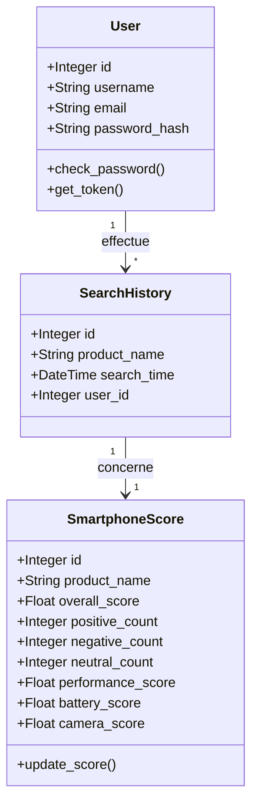
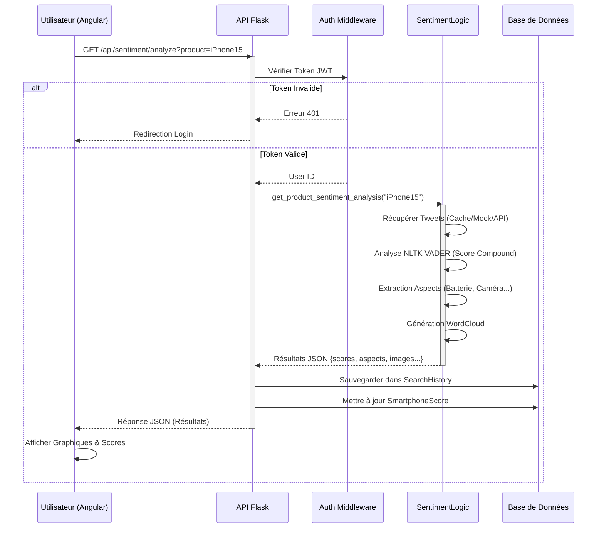

# Rapport de Stage : Application d'Analyse de Sentiments pour Smartphones

**Auteur :** [Votre Nom]
**Entreprise :** [Nom de l'Entreprise]
**Date :** Janvier 2026

---

## 1. Introduction

### 1.1 Contexte
Dans le marché actuel des smartphones, extrêmement concurrentiel, les consommateurs sont submergés par le nombre de modèles et d'avis disponibles. Il devient difficile de se faire une opinion objective basée uniquement sur des fiches techniques. Les avis utilisateurs sur les réseaux sociaux, notamment Twitter (X), constituent une mine d'or d'informations reflétant l'expérience réelle des utilisateurs.

### 1.2 Objectif du Stage
L'objectif de ce stage était de concevoir et développer une application web capable d'agréger, d'analyser et de visualiser les sentiments des utilisateurs concernant différents modèles de smartphones. L'application doit permettre de :
*   Rechercher un smartphone spécifique.
*   Analyser les sentiments (positifs, négatifs, neutres) à partir de tweets réels ou simulés.
*   Extraire des scores spécifiques par aspect (Batterie, Caméra, Performance, Prix).
*   Comparer deux smartphones côte à côte.
*   Visualiser les résultats sous forme de graphiques intuitifs.

---

## 2. Analyse des Besoins

### 2.1 Besoins Fonctionnels
L'application doit répondre aux fonctionnalités suivantes :

1.  **Authentification Utilisateur** :
    *   Inscription et connexion sécurisée (JWT).
    *   Gestion de session utilisateur.
2.  **Recherche et Analyse** :
    *   L'utilisateur peut saisir le nom d'un smartphone.
    *   Le système récupère des tweets pertinents.
    *   Le système analyse le sentiment global et par aspect (NLP).
3.  **Visualisation des Données** :
    *   Affichage d'un score global sur 10.
    *   Graphiques de répartition des sentiments (Camembert/Barres).
    *   Nuage de mots clés (Word Cloud).
4.  **Comparaison** :
    *   Possibilité de comparer deux recherches simultanément.
5.  **Historique** :
    *   Sauvegarde automatique des recherches de l'utilisateur.
    *   Consultation de l'historique personnel.
6.  **Classements (Top Smartphones)** :
    *   Affichage des smartphones les mieux notés par catégorie (Performance, Batterie, etc.).

### 2.2 Besoins Non-Fonctionnels
*   **Performance** : L'analyse doit être rapide (utilisation de cache).
*   **Ergonomie** : Interface utilisateur moderne, responsive et intuitive (Angular, Design System).
*   **Fiabilité** : Gestion des erreurs (ex: API externe indisponible).

---

## 3. Architecture Technique

Le projet repose sur une architecture client-serveur moderne (REST API).

### 3.1 Stack Technologique

*   **Frontend (Interface Utilisateur)** :
    *   **Framework** : Angular 17+ (basé sur TypeScript).
    *   **Style** : CSS modulaire, design responsive "Soft UI".
    *   **Graphiques** : Chart.js / ng2-charts.
*   **Backend (API & Logique)** :
    *   **Framework** : Flask (Python).
    *   **Base de Données** : SQLite (Dev) avec SQLAlchemy (ORM).
    *   **Authentification** : Flask-JWT-Extended.
*   **Traitement de Données (IA/NLP)** :
    *   **NLTK (Natural Language Toolkit)** : Tokenisation et analyse de sentiments (VADER).
    *   **WordCloud** : Génération de nuages de mots.

---

## 4. Conception et Modélisation (UML)

Cette section détaille la conception du système à l'aide de diagrammes UML normalisés.

### 4.1 Diagramme de Cas d'Utilisation
Ce diagramme illustre les interactions possibles entre l'utilisateur et le système.

```mermaid
usecaseDiagram
    actor "Utilisateur" as User
    actor "Administrateur" as Admin

    package "Système d'Analyse de Sentiments" {
        usecase "S'inscrire / Se connecter" as Auth
        usecase "Rechercher un Smartphone" as Search
        usecase "Comparer deux Smartphones" as Compare
        usecase "Visualiser les Résultats (Graphiques)" as ViewResults
        usecase "Consulter l'Historique" as ViewHistory
        usecase "Voir le Top Classement" as ViewTop
    }

    User --> Auth
    User --> Search
    User --> ViewTop
    User --> ViewHistory
    
    Search ..> ViewResults : include
    Search <.. Compare : extend

    note right of Auth : JWT Token requis pour\nles autres actions
```

### 4.2 Diagramme de Classes
Ce diagramme représente la structure des données persistantes dans la base de données.



### 4.3 Diagramme de Séquence : Analyse d'un Sentiment
Ce diagramme détaille le flux d'exécution lorsqu'un utilisateur lance une analyse.



---

## 5. Réalisation et Développement

### 5.1 Développement Backend
Le backend a été nettoyé pour passer d'une architecture monolithique (rendu serveur) à une architecture **API REST**.
*   **`app.py`** : Point d'entrée allégé, ne gère que la configuration et les routes API.
*   **`api.py`** : Contient tous les endpoints (`/auth`, `/sentiment`, `/history`).
*   **`sentiment_logic.py`** : Cœur du système. Il encapsule la complexité de l'analyse linguistique. Il utilise un système de **Cache** pour éviter de refaire les mêmes analyses coûteuses en temps.

### 5.2 Développement Frontend
Le frontend Angular a été structuré en composants réutilisables :
*   **Dashboard** : Vue principale avec les cartes de statistiques.
*   **ResultComponent** : Affiche les jauges de scores et les diagrammes circulaires.
*   **Services** : `AuthService` et `ApiService` centralisent les appels HTTP pour une meilleure maintenabilité.

### 5.3 Sécurité
L'intégration de **JWT (JSON Web Tokens)** assure que l'API est "stateless". Le frontend stocke le token de manière sécurisée et l'envoie à chaque requête, garantissant que seuls les utilisateurs authentifiés peuvent lancer des analyses coûteuses.

---

## 6. Conclusion et Perspectives

### 6.1 Bilan
Ce stage a permis de réaliser une application complète, fonctionnelle et moderne. L'architecture séparée (Angular + Flask) offre une grande flexibilité et permettrait, par exemple, de développer une application mobile native utilisant la même API sans modifier le backend.

### 6.2 Améliorations Futures
*   **Connexion API Twitter Live** : Remplacer les datasets locaux par l'API officielle X (Twitter) pour des données temps réel (nécessite un compte développeur payant).
*   **Deep Learning** : Remplacer NLTK (basé sur des règles) par un modèle Transformer (ex: BERT) pour une meilleure détection du sarcasme.
*   **Support Multilingue** : Étendre l'analyse aux tweets en français et espagnol.
